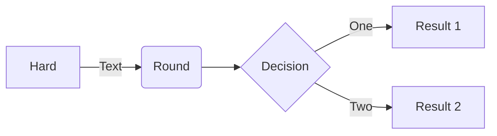

<!--
SPDX-FileCopyrightText: 2023 Frans van Dorsselaer

SPDX-License-Identifier: MIT
-->

# This is the **HOMEPAGE**

> [!NOTE]
> Information the user should notice even if skimming.

> [!TIP]
> Optional information to help a user be more successful.

> [!IMPORTANT]
> Essential information required for user success.

> [!CAUTION]
> Negative potential consequences of an action.

> [!WARNING]
> Dangerous certain consequences of an action.

> [!TODO]
> This needs to be done.

Refer to [Markdown](http://daringfireball.net/projects/markdown/) for how to write markdown files.

## Quick Start Notes

1. Add images to the *images* folder if the file is referencing an image.

## MathJax example

Inline: $\sqrt{3x-1}+(1+x)^2$

Or paragraph:

$$\left( \sum_{k=1}^n a_k b_k \right)^2 \leq \left( \sum_{k=1}^n a_k^2 \right) \left( \sum_{k=1}^n b_k^2 \right)$$

## Mermaid example

